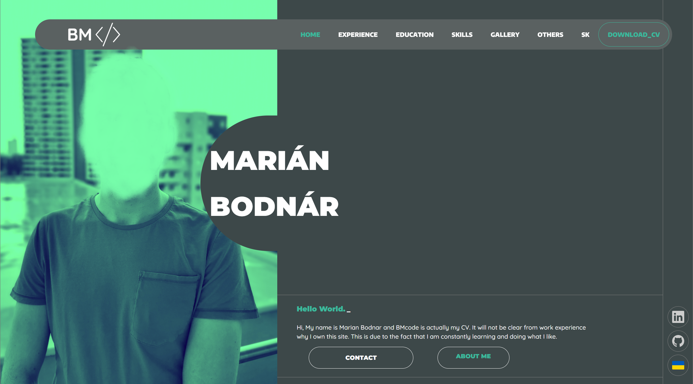
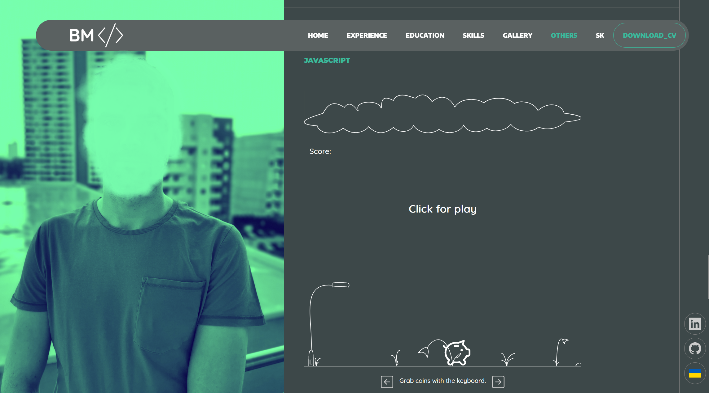

# BMCODE - Personal CV

Welcome to the official repository for BMCODE, my personal online CV crafted using Vue.js. This site is not only a demonstration of my technical skills but also an interactive portfolio that represents my professional journey and achievements.

## About the Website

BMCODE serves as a digital curriculum vitae, designed to highlight my expertise and projects in a dynamic and engaging manner. Built with Vue.js, this platform showcases how cutting-edge web technologies can be leveraged to create a personal and professional online presence. It's the perfect blend of functionality and aesthetics, designed to impress potential employers and networking contacts.

## Key Technologies

- **Vue.js:** Provides a component-based architecture that enhances the CV with a smooth and interactive user experience.
- **jQuery:** Utilized for DOM manipulations.
- **i18n:** Integrates internationalization to support multiple languages on the CV, making it accessible to a global audience.
- **jQuery with PHP:** Uses AJAX to call a PHP script, handling form data submission securely and sending messages directly to an email address without page refresh.
- **PHP:** Manages the server-side processing of form data, ensuring secure and efficient handling of email transmissions.

## Screenshots

Here are a few screenshots that provide a glimpse into the design and functionality of MyWebsite:

### Loading Screen

_This screen features a visually appealing loading animation with a jumping spinner that entertains users while the site content loads. It's designed to enhance the user experience by providing a smooth transition as they enter the site._

### Main Page

_Once the loading screen completes, visitors are presented with the main page. This view serves as the primary interface of the website, offering a clean and simple layout for easy navigation._

### JS Game Page

_This page features an interactive JavaScript game where players control a pig trying to catch coins falling from a cloud. The game is designed to be fun and engaging, adding a playful element to the site._

